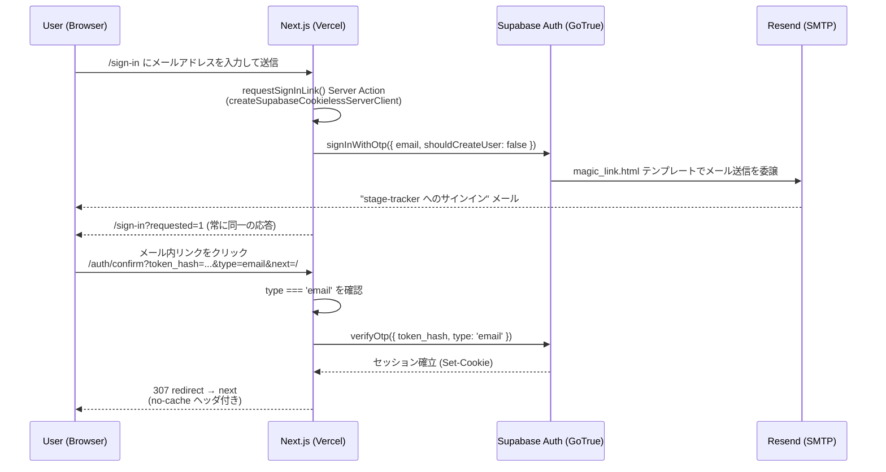

# 認証フロー（Magic Link / Passkey）

Canonical context: Issue #66（Magic Link）、Issue #106（Passkey）。現時点で
実装済みの認証フローの記録です。新しい設計の提案ではありません。

関連: [docs/architecture/runtime-stack.md](runtime-stack.md)（サービス構成
全体）。

## 全体像

stage-tracker は password 認証を持たず、account bootstrap / recovery は
Supabase Auth の Magic Link（email OTP）のみで行います。日常の primary
sign-in path としては、これに加えて Passkey（Supabase Auth WebAuthn,
Beta。Issue #106）を提供します。Passkey は Magic Link を置換するもので
はなく、既に provisioned / confirmed な account へ追加する optional
credential です（詳細は「## Passkey（WebAuthn, Beta）」節）。Auth
プロバイダーの追加設定はすべて `enabled = false` で、外部 OAuth や
anonymous sign-in は使用していません（`supabase/config.toml` の
`[auth.external.*]` / `enable_anonymous_sign_ins`）。

サインアップは自己サービスでは行えません（`enable_signup = false`）。
アカウントは `scripts/provision-user.mjs` によるオペレーターの事前作成のみで、
`signInWithOtp` にも `shouldCreateUser: false` を明示しています
（[src/infrastructure/supabase/magicLink.ts](../../src/infrastructure/supabase/magicLink.ts)）。

## Sequence diagram

## サインイン要求（`/sign-in`）

- [src/app/sign-in/actions.ts](../../src/app/sign-in/actions.ts) の
  `requestSignInLink` Server Action がエントリポイントです。
- `createSupabaseCookielessServerClient()`
  （[src/infrastructure/supabase/serverClient.ts](../../src/infrastructure/supabase/serverClient.ts)）
  を意図的に使用します。通常の Server Client では、既存アカウントに対して
  supabase-js が PKCE code verifier を Cookie に書き込み、存在しないアカウント
  では Cookie をクリアするため、`Set-Cookie` の有無がアカウント存在を漏らす
  enumeration oracle になります。Cookie 書き込みを完全に破棄することで、この
  oracle を構造的に排除しています。
- [src/infrastructure/supabase/magicLink.ts](../../src/infrastructure/supabase/magicLink.ts)
  の `requestMagicLink()` は結果を一切返しません。以前のリビジョンは分類済み
  の結果を返していましたが、redirect 先の分岐・4xx/5xx の分岐・
  `error.status` の有無による分岐のいずれも account-existence oracle になる
  ことが判明したため、呼び出し元へは何も返さない設計にしています。失敗は
  すべてサーバー側のみで観測可能な `diagnostics` チャネルへ送られます
  （未認証の呼び出し元からは観測不可能）。
- Server Action の応答は常に `/sign-in?requested=1` の一択です。アカウントの
  有無・メール送信の成否・SMTP/Resend 側の障害、いずれの場合も同一の
  status・Location・body・Cookie で応答します。

### Vercel Preview の Magic Link origin

- Production の Supabase Auth **Site URL は `https://stage-tracker.com` を
  canonical のまま維持**します。Production で redirect target を明示しない
  current request は、引き続き Site URL fallback を使います。Local も
  `supabase/config.toml` の local Site URL fallback を使います。
- Vercel Preview でだけ、Server Action が Next.js の Vercel Framework
  Environment Variables の `NEXT_PUBLIC_VERCEL_ENV === "preview"` と、まず
  `NEXT_PUBLIC_VERCEL_BRANCH_URL`（scheme なしの Git branch host）、無ければ
  `NEXT_PUBLIC_VERCEL_URL`（scheme なしの generated deployment host）を読み、
  `https://<trusted-host>/`（trailing slash付き）を `emailRedirectTo` として
  Supabase Auth へ渡します。このcanonicalizationはSupabaseが案内するVercel
  wildcard `https://*-reitojike.vercel.app/**` とcallback pathを連結した
  redirect URLの互換性を保つためです。templateはこの値へ `auth/confirm` を
  直接連結するため、`//auth/confirm` は生成しません。
  `NEXT_PUBLIC_VERCEL_PROJECT_PRODUCTION_URL` は Preview でも Production を指す
  ため使用しません。request の `Host` / `X-Forwarded-Host`、form input、query
  parameter は redirect authority に使いません。
- hosted Supabase Auth の Redirect URLs には、current account slug に bounded な
  `https://*-reitojike.vercel.app/**` を Preview 用として追加します。これは
  Supabase 側の operator-owned 設定であり、`https://**` のような broad allowlist
  にはしません。Previewごとのexact Redirect URLはsteady stateでは不要です。
- `supabase/templates/magic_link.html` は `.RedirectTo` が空、または `.SiteURL` と
  同値なら `.SiteURL` fallbackを使い、それ以外の明示Preview targetだけを使います。
  GoTrueはredirect指定なしのrequestでも `.RedirectTo` にSite URLをfallback値として
  渡すため、この同値判定が必要です。Preview targetはtrailing slash付きなので、
  templateはそこへ `auth/confirm` を直接連結します。hosted Supabase の Magic Link
  templateもこのrepositoryのcanonical templateと同じsemanticにmaterializeして
  ください。template変更だけではhosted projectは更新されません。
- Preview は現時点で Production と同じ hosted Supabase を使う想定です。そのため
  Preview の authenticated write は real remote dogfood dataへ反映され得ます。
  検証では private test/dogfood data を最小限に扱い、shared/production data の
  destructive mutation は行いません。Preview runtime に必要なのは public な
  Supabase URL / anon key だけで、service-role key は不要です。

Next.js の Framework Environment Variables は Vercel の Framework Preset に
基づいて Preview deployment へ自動付与されます。Preview scope の public
Supabase URL / anon key 以外に、legacy raw `VERCEL_ENV` / `VERCEL_URL` のための
System Environment Variables exposure switchを要求しません。この契約への変更は、
PR #269 のPreview smokeでraw env前提がProduction fallbackを生んだためです。

PR #269 の追加remote evidenceとして、bare Preview originと上記wildcardだけの
組み合わせではSupabaseが `Site URL`（Production）へfallbackしました。operatorが
一時的にbare Preview exact URLを追加するとPreview redirect/authが成功しました。
この失敗・一時的成功の証跡は保持し、trailing slash修正後はexact URLを削除した
wildcard-only状態で再検証します。

この節の Dashboard / Vercel 設定の materialization と実機メール検証は
operator-owned です。設定完了を agent が推測で扱わず、operator-confirmed または
未確認として記録します。

## メール配送経路（Resend 経由の Custom SMTP）

- Supabase Auth の Custom SMTP 設定（Dashboard → Authentication → SMTP
  Settings）に Resend の SMTP 資格情報が入力されています。この資格情報は
  リポジトリにも Vercel にも存在せず、Dashboard にのみ保持されます
  （詳細は [runtime-stack.md](runtime-stack.md) の Environment Variables
  節）。
- 送信ドメインは `stage-tracker.com` ルートドメインで Resend 側の domain
  verification が完了しており、Cloudflare DNS に SPF/DKIM/DMARC レコードが
  設定されています。
- verified sender と実際の From アドレスが一致していない場合、Resend側で
  送信が拒絶され、magic link メールが無言で届かなくなる点に注意が必要です
  （運用上の既知の failure mode）。

## `supabase/templates/magic_link.html` の位置づけ

- このファイルがメールテンプレートの **source of truth** です。
  `supabase/config.toml` の `[auth.email.template.magic_link]` が
  `content_path` としてこのファイルを参照します。
- Supabase の既定テンプレートは、GoTrue 自身の `/auth/v1/verify`
  エンドポイントへ直接リンクし、このアプリの `/auth/confirm` route handler
  を完全にバイパスします。`{{ .TokenHash }}` を使ってこのアプリ自身の
  route へリンクを向けることが、このテンプレートを上書きしている理由です
  （config.toml 内のコメント参照）。
- Local dev では `supabase/config.toml` 経由でこのファイルが自動的に反映
  されます。Remote（Production）project では **`supabase config push` を
  使わない**運用のため、このファイルの内容を Supabase Dashboard の Email
  Templates → Magic Link へ手動でペーストする必要があります（理由は
  [runtime-stack.md](runtime-stack.md) の「なぜ `supabase config push` を
  remote へ使わないか」節）。このファイルを変更した場合、Dashboard 側への
  反映を忘れると local と remote でテンプレートが乖離します。

## `/auth/confirm` と `verifyOtp(token_hash)`

[src/app/auth/confirm/route.ts](../../src/app/auth/confirm/route.ts) が
唯一の magic link 着地点です。

- クエリパラメータ `token_hash` / `type` / `next` を読み取ります。`next` は
  `safeRedirectPath()`（[src/domain/redirectSafety.ts](../../src/domain/redirectSafety.ts)）
  でサニタイズされます。
- `type` は `'email'` のみを受理します。GoTrue の `EmailOtpType` は
  `recovery` / `invite` / `email_change` など他の型も許容する文字列型で
  あるため、無検証で受理すると、サインインに見えるリンク経由で
  意図しない他フロー（例: email change の completion）を実行させて
  しまう可能性があります。このプロダクトが `/auth/confirm` で消費するのは
  sign-in 用の magic link だけであり、他フローには別 route と別 UI が
  必要という前提です。
- `createSupabaseServerClient()`
  （通常の、Cookie 書き込みを行う Server Client）を使い、
  `supabase.auth.verifyOtp({ token_hash, type: 'email' })` を呼びます。
- 成功時は 307 redirect で `next` へ遷移します。この応答は
  `Cache-Control: private, no-cache, no-store, must-revalidate, max-age=0`
  等の no-cache ヘッダを明示的に付与しています。この応答には発行直後の
  セッション Cookie が乗るため、CDN やリバースプロキシにキャッシュされると
  別ユーザーへ同一セッションが再生されかねないためです。
- 失敗時（`token_hash` なし、`type` 不一致、`verifyOtp` エラー）は
  `/sign-in?error=link_expired` へ redirect します。

## Session 確立までの流れ

1. `verifyOtp()` 成功時、`@supabase/ssr` の `createServerClient` が
   `setAll()` コールバック経由でセッション Cookie を Response へ書き込みます
   （`createSupabaseServerClient()` 内、通常の Cookie 書き込みパス）。
2. 以降の全リクエストは、[src/proxy.ts](../../src/proxy.ts) の `proxy()` を
   経由します。Next.js 16.3 以降で `middleware.ts` に代わって使われる規約
   （`proxy()` エクスポート + `config.matcher`）で書かれた、この
   プロダクトにおける Middleware 相当の実体です。
   - `matcher` は `_next/static` / `_next/image` / `favicon.ico` と、
     PWA の public resource（Issue #304）以外のほぼ全パスを対象にします。
     PWA 側の除外対象は `/manifest.webmanifest` と
     `/pwa/` 配下の application icon 4 件で、いずれも
     [src/pwa/appIdentity.ts](../../src/pwa/appIdentity.ts) の
     `PWA_PUBLIC_ASSET_PATHS` が正本です。install prompt は sign-in より
     前に評価されるため、これらは未認証でも取得できる必要があります。
   - この PWA 除外は **exact-path** です。`$` で終端を固定しているため
     `/pwa/icon-192.png` だけが対象で、`/pwa/`・`/pwa/other.png`・
     `/pwa/icon-192.png/sub` はいずれも既存どおり default-deny のままです。
     `public/pwa/` はこれらの asset 専用とし、application route を
     この path から提供しません。file-extension による一括除外は引き続き
     採用していません（`/events/some-future-page.png` のような
     application path まで境界を抜けてしまうため）。
     `config.matcher` は Next.js が静的解析する必要があるため
     `PWA_PUBLIC_ASSET_PATHS` を import できず、literal として二重に
     書かれています。両者の一致は
     `src/pwa/__tests__/appIdentity.test.ts` が、実 HTTP 上の挙動は
     `test/auth/routeProtection.test.ts` が検証します。
   - 毎リクエストで `supabase.auth.getUser()` を呼び、`@supabase/ssr` の
     `setAll()` コールバック経由でリフレッシュ後のセッション Cookie を
     Response（および redirect 発生時はその redirect レスポンス）へ
     書き戻します。**セッションの確実なリフレッシュはここで行われています。**
   - 同時に認証境界そのものも強制します。`PUBLIC_PATHS`
     （`/sign-in` / `/auth/confirm` のみ、exact match）以外は認証済みで
     ない限り `/sign-in` へ redirect し、認証済みユーザーが `/sign-in` へ
     来た場合は `/` へ redirect します。新しく追加された route は、明示的に
     `PUBLIC_PATHS` へ追加しない限りデフォルトで認証必須になる設計です。
     Issue #304 の PWA resource は `PUBLIC_PATHS` ではなく上記の `matcher`
     除外として公開しています。session を読む必要が無い静的 asset のため、
     icon 1 件ごとに `supabase.auth.getUser()` を走らせないためです。
     PWA resource の追加は、この `matcher` 除外の範囲に閉じており、
     application route 側の default-deny を緩めていません。
3. Server Component / Route Handler / Server Action は、都度
   `createSupabaseServerClient()` を呼び、`proxy.ts` によって既にリフレッシュ
   済みの Cookie からセッションを読み取ります。
   [src/infrastructure/supabase/session.ts](../../src/infrastructure/supabase/session.ts)
   の `getAuthenticatedUser()` がこの読み取りの主な呼び出し口です。

### コメント上の呼称のずれ（解消済み・履歴記録）

Issue #66 完了時点では `serverClient.ts` の 39 行目・57 行目のコメントが、
この Middleware 相当の実体を古い `middleware.ts` という名前で参照していま
した。Next.js 16.3 で規約が `middleware.ts` から `proxy.ts` / `proxy()` へ
変わったためのずれで、機能自体（セッションリフレッシュ）は当時から正しく
`proxy.ts` によって行われていました。Issue #61 の docs consistency 対応で
コメントを `proxy.ts` を指すよう修正済みです。

## なぜ `token_hash` 方式を維持しているか

- Supabase の既定の Magic Link 挙動（`/auth/v1/verify` への直接リンク）を
  使わず、`{{ .TokenHash }}` を使った自前テンプレート + 自前 `/auth/confirm`
  route の組み合わせを採用しているのは、Supabase が公開している Next.js
  server-side auth パターンに従ったものです（`/auth/confirm/route.ts` の
  コメント参照）。
- `token_hash` は PKCE の code verifier を必要としません。これは
  `createSupabaseCookielessServerClient()` が Cookie 書き込みを完全に
  破棄できる前提でもあります — code verifier を Cookie に保存する必要が
  そもそもないため、Cookie を捨てても sign-in フロー自体は成立します。

## なぜ implicit flow 等の追加 workaround を採用しなかったか

- implicit flow（フラグメント経由のトークン受け渡し）は、サーバー側の
  Route Handler で完結する `token_hash` + `verifyOtp()` の構成と比べて、
  トークンをクライアントサイド JavaScript で扱う必要があり、上記の
  cookieless enumeration-oracle 対策や no-cache 制御など、このプロダクトが
  明示的に対処しているセキュリティ上の配慮を再実装する必要があります。
- 本プロダクトは Supabase が推奨する Next.js server-side パターン
  （`token_hash` + `/auth/confirm` route handler）にそのまま従うことで、
  上記の対策を Route Handler 一箇所に閉じ込めています。追加の workaround
  （implicit flow 対応、PKCE code verifier の独自管理等）を導入する理由は
  現時点でありません。

## Passkey（WebAuthn, Beta）

Canonical context: Issue #106。採用判断・maturity評価・test automation
boundaryの詳細は [Issue #106 の Phase 1 checkpoint コメント](https://github.com/reitojike/stage-tracker/issues/106)
に記録済みで、ここでは重複しません。

- Supabase Auth Passkey は 2026-05-28 公開の Beta（experimental）機能です。
  `auth.experimental.passkey: true` を client 初期化時に明示しないと全
  passkey method が reject されます
  （[src/infrastructure/supabase/browserClient.ts](../../src/infrastructure/supabase/browserClient.ts)、
  [src/infrastructure/supabase/serverClient.ts](../../src/infrastructure/supabase/serverClient.ts)）。
- WebAuthn ceremony（`navigator.credentials.create()`/`get()`）は browser
  専用のため、`registerPasskey()` / `signInWithPasskey()` は client
  component からのみ呼び出します
  （[src/app/sign-in/_components/PasskeySignInButton.tsx](../../src/app/sign-in/_components/PasskeySignInButton.tsx)、
  [src/app/mypage/_components/RegisterPasskeyButton.tsx](../../src/app/mypage/_components/RegisterPasskeyButton.tsx)）。
- credential 管理（一覧・削除）は `auth.passkey.list()` / `.delete()` を
  使い、`auth.admin.passkey.*`（service_role 必須）は使用しません。現在の
  signed-in userの session scopeに限定されるため、通常の Server
  Component / Server Action から安全に呼べます
  （[src/infrastructure/supabase/passkey.ts](../../src/infrastructure/supabase/passkey.ts)）。
- Passkey 未登録 user は従来どおり Magic Link でサインインできます。
  Passkey 側の失敗・credential 喪失時も Magic Link へ fallback でき、
  account lockout は発生しません。
- Local dev の RP 設定は `supabase/config.toml` の `[auth.passkey]` /
  `[auth.webauthn]`（`rp_id = "127.0.0.1"`、既存 `site_url` と一致）です。
  本番 RP ID / Origins は Supabase Dashboard 側の operational step として
  別途設定が必要で、remote Supabase project の provisioning と同様この
  repository の merge gate には含めません。
- WebAuthn ceremony 自体（実機の Face ID / Touch ID / Windows Hello 等）は
  platform authenticator を要する browser 専用の API であり、このリポジトリ
  の `test:auth`（Node の `--test` ランナーで実 HTTP リクエストを送り、
  必要な test だけ `playwright-core` 経由の headless system Chrome を使う
  方式 - `test/auth/support/browserPage.ts`）では自動化していません。
  session/認可境界・Magic Link fallback・public signup 非復活は
  [test/auth/passkey.test.ts](../../test/auth/passkey.test.ts) で自動検証
  し、実際の WebAuthn ceremony は manual smoke 対象です。
