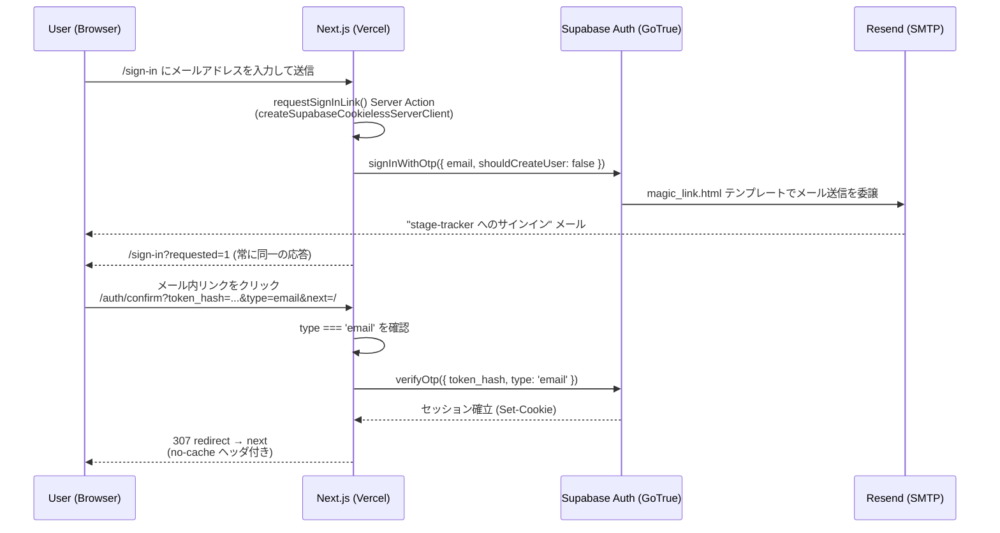

# 認証フロー（Magic Link）

Canonical context: Issue #66。現時点で実装済みの Magic Link 認証フローの
記録です。新しい設計の提案ではありません。

関連: [docs/architecture/runtime-stack.md](runtime-stack.md)（サービス構成
全体）。

## 全体像

stage-tracker は password 認証を持たず、Supabase Auth の Magic Link
（email OTP）のみで認証します。Auth プロバイダーの追加設定はすべて
`enabled = false` で、外部 OAuth や anonymous sign-in は使用していません
（`supabase/config.toml` の `[auth.external.*]` / `enable_anonymous_sign_ins`）。

サインアップは自己サービスでは行えません（`enable_signup = false`）。
アカウントは `scripts/provision-user.mjs` によるオペレーターの事前作成のみで、
`signInWithOtp` にも `shouldCreateUser: false` を明示しています
（[src/infrastructure/supabase/magicLink.ts](../../src/infrastructure/supabase/magicLink.ts)）。

## Sequence diagram

## サインイン要求（`/sign-in`）

- [src/app/sign-in/actions.ts](../../src/app/sign-in/actions.ts) の
  `requestSignInLink` Server Action がエントリポイントです。
- `createSupabaseCookielessServerClient()`
  （[src/infrastructure/supabase/serverClient.ts](../../src/infrastructure/supabase/serverClient.ts)）
  を意図的に使用します。通常の Server Client では、既存アカウントに対して
  supabase-js が PKCE code verifier を Cookie に書き込み、存在しないアカウント
  では Cookie をクリアするため、`Set-Cookie` の有無がアカウント存在を漏らす
  enumeration oracle になります。Cookie 書き込みを完全に破棄することで、この
  oracle を構造的に排除しています。
- [src/infrastructure/supabase/magicLink.ts](../../src/infrastructure/supabase/magicLink.ts)
  の `requestMagicLink()` は結果を一切返しません。以前のリビジョンは分類済み
  の結果を返していましたが、redirect 先の分岐・4xx/5xx の分岐・
  `error.status` の有無による分岐のいずれも account-existence oracle になる
  ことが判明したため、呼び出し元へは何も返さない設計にしています。失敗は
  すべてサーバー側のみで観測可能な `diagnostics` チャネルへ送られます
  （未認証の呼び出し元からは観測不可能）。
- Server Action の応答は常に `/sign-in?requested=1` の一択です。アカウントの
  有無・メール送信の成否・SMTP/Resend 側の障害、いずれの場合も同一の
  status・Location・body・Cookie で応答します。

## メール配送経路（Resend 経由の Custom SMTP）

- Supabase Auth の Custom SMTP 設定（Dashboard → Authentication → SMTP
  Settings）に Resend の SMTP 資格情報が入力されています。この資格情報は
  リポジトリにも Vercel にも存在せず、Dashboard にのみ保持されます
  （詳細は [runtime-stack.md](runtime-stack.md) の Environment Variables
  節）。
- 送信ドメインは `stage-tracker.com` ルートドメインで Resend 側の domain
  verification が完了しており、Cloudflare DNS に SPF/DKIM/DMARC レコードが
  設定されています。
- verified sender と実際の From アドレスが一致していない場合、Resend側で
  送信が拒絶され、magic link メールが無言で届かなくなる点に注意が必要です
  （運用上の既知の failure mode）。

## `supabase/templates/magic_link.html` の位置づけ

- このファイルがメールテンプレートの **source of truth** です。
  `supabase/config.toml` の `[auth.email.template.magic_link]` が
  `content_path` としてこのファイルを参照します。
- Supabase の既定テンプレートは、GoTrue 自身の `/auth/v1/verify`
  エンドポイントへ直接リンクし、このアプリの `/auth/confirm` route handler
  を完全にバイパスします。`{{ .TokenHash }}` を使ってこのアプリ自身の
  route へリンクを向けることが、このテンプレートを上書きしている理由です
  （config.toml 内のコメント参照）。
- Local dev では `supabase/config.toml` 経由でこのファイルが自動的に反映
  されます。Remote（Production）project では **`supabase config push` を
  使わない**運用のため、このファイルの内容を Supabase Dashboard の Email
  Templates → Magic Link へ手動でペーストする必要があります（理由は
  [runtime-stack.md](runtime-stack.md) の「なぜ `supabase config push` を
  remote へ使わないか」節）。このファイルを変更した場合、Dashboard 側への
  反映を忘れると local と remote でテンプレートが乖離します。

## `/auth/confirm` と `verifyOtp(token_hash)`

[src/app/auth/confirm/route.ts](../../src/app/auth/confirm/route.ts) が
唯一の magic link 着地点です。

- クエリパラメータ `token_hash` / `type` / `next` を読み取ります。`next` は
  `safeRedirectPath()`（[src/domain/redirectSafety.ts](../../src/domain/redirectSafety.ts)）
  でサニタイズされます。
- `type` は `'email'` のみを受理します。GoTrue の `EmailOtpType` は
  `recovery` / `invite` / `email_change` など他の型も許容する文字列型で
  あるため、無検証で受理すると、サインインに見えるリンク経由で
  意図しない他フロー（例: email change の completion）を実行させて
  しまう可能性があります。このプロダクトが `/auth/confirm` で消費するのは
  sign-in 用の magic link だけであり、他フローには別 route と別 UI が
  必要という前提です。
- `createSupabaseServerClient()`
  （通常の、Cookie 書き込みを行う Server Client）を使い、
  `supabase.auth.verifyOtp({ token_hash, type: 'email' })` を呼びます。
- 成功時は 307 redirect で `next` へ遷移します。この応答は
  `Cache-Control: private, no-cache, no-store, must-revalidate, max-age=0`
  等の no-cache ヘッダを明示的に付与しています。この応答には発行直後の
  セッション Cookie が乗るため、CDN やリバースプロキシにキャッシュされると
  別ユーザーへ同一セッションが再生されかねないためです。
- 失敗時（`token_hash` なし、`type` 不一致、`verifyOtp` エラー）は
  `/sign-in?error=link_expired` へ redirect します。

## Session 確立までの流れ

1. `verifyOtp()` 成功時、`@supabase/ssr` の `createServerClient` が
   `setAll()` コールバック経由でセッション Cookie を Response へ書き込みます
   （`createSupabaseServerClient()` 内、通常の Cookie 書き込みパス）。
2. 以降のリクエストでは、Server Component / Route Handler / Server Action が
   都度 `createSupabaseServerClient()` を呼び、Cookie からセッションを
   読み取ります。
   [src/infrastructure/supabase/session.ts](../../src/infrastructure/supabase/session.ts)
   の `getAuthenticatedUser()` がこの読み取りの主な呼び出し口です。

### 既知のギャップ：`middleware.ts` は存在しない

`serverClient.ts` の 39 行目・57 行目のコメントは、いずれも
「`middleware.ts` が毎リクエストでセッションをリフレッシュする」ことを前提に
書かれています。しかし、現在のリポジトリには `src/middleware.ts` も
ルート直下の `middleware.ts` も **存在しません**。

このドキュメントはこのギャップを実装の追加提案なしに事実として記録します。
現状、セッションのリフレッシュは Server Component の render 中に発生した
`setAll()` の書き込みが（読み取り専用の Cookie ストアであるため）
サイレントに破棄される経路に依存しており、`middleware.ts` が担うはずだった
「毎リクエストでの確実なリフレッシュ」は行われていません。この扱いを
どうするか（`middleware.ts` を追加するか、コメントを実態に合わせて修正
するか）は別途の product task として判断が必要です。

## なぜ `token_hash` 方式を維持しているか

- Supabase の既定の Magic Link 挙動（`/auth/v1/verify` への直接リンク）を
  使わず、`{{ .TokenHash }}` を使った自前テンプレート + 自前 `/auth/confirm`
  route の組み合わせを採用しているのは、Supabase が公開している Next.js
  server-side auth パターンに従ったものです（`/auth/confirm/route.ts` の
  コメント参照）。
- `token_hash` は PKCE の code verifier を必要としません。これは
  `createSupabaseCookielessServerClient()` が Cookie 書き込みを完全に
  破棄できる前提でもあります — code verifier を Cookie に保存する必要が
  そもそもないため、Cookie を捨てても sign-in フロー自体は成立します。

## なぜ implicit flow 等の追加 workaround を採用しなかったか

- implicit flow（フラグメント経由のトークン受け渡し）は、サーバー側の
  Route Handler で完結する `token_hash` + `verifyOtp()` の構成と比べて、
  トークンをクライアントサイド JavaScript で扱う必要があり、上記の
  cookieless enumeration-oracle 対策や no-cache 制御など、このプロダクトが
  明示的に対処しているセキュリティ上の配慮を再実装する必要があります。
- 本プロダクトは Supabase が推奨する Next.js server-side パターン
  （`token_hash` + `/auth/confirm` route handler）にそのまま従うことで、
  上記の対策を Route Handler 一箇所に閉じ込めています。追加の workaround
  （implicit flow 対応、PKCE code verifier の独自管理等）を導入する理由は
  現時点でありません。
