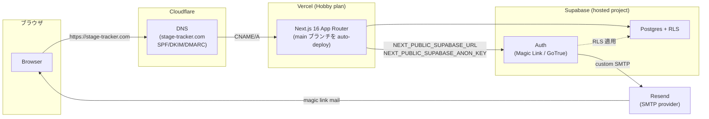

# Production ランタイム構成

Canonical context: Issue #66。このドキュメントは新しいアーキテクチャの設計では
なく、現時点で実際に構築・運用されている実環境の記録です。実装の source of
truth は依然としてこのリポジトリ（migrations / route handler / config.toml）
であり、Dashboard 上の手動設定はここに記録した範囲でのみ効力を持ちます。

関連する既存ドキュメント:

- [docs/runbooks/gate-a-remote-environment.md](../runbooks/gate-a-remote-environment.md)
  — Gate A（2 ユーザー dogfood）環境の provisioning 手順書。本ドキュメントとの
  差分は「Local / CI / Remote 環境との差分」節と「既知の記載ずれ」節を参照。
- [docs/architecture/authentication.md](authentication.md) — Magic Link
  認証フローの詳細。

## 利用サービス一覧と責務

| サービス       | 責務                                                                                                 |
| -------------- | ---------------------------------------------------------------------------------------------------- |
| **Vercel**     | Next.js アプリケーションのホスティング、Production domain routing、Environment Variables の配布      |
| **Cloudflare** | `stage-tracker.com` の Registrar（ドメイン取得）と DNS 管理、Resend 送信用の SPF/DKIM/DMARC レコード |
| **Supabase**   | Authentication（Magic Link / Passkey）、Postgres Database、RLS by migration                          |
| **Resend**     | Supabase Auth のメール配送用 SMTP provider                                                           |
| **GitHub**     | Source control、Issue/PR ワークフロー、CI（`verify.yml`）                                            |

## Production 構成図



- `stage-tracker.com`（サブドメインではなくルートドメイン）が Vercel の
  Production domain です。Cloudflare 側でこのドメインを取得・DNS 管理し、
  Vercel プロジェクトへ向けています。
- GitHub Actions（`verify.yml` / `claude-review.yml`）は Production の
  deploy パイプラインには関与しません。Vercel が `main` への push を検知して
  auto-deploy する構成であり、CI は「PR の merge 前検証」の役割に閉じています
  （詳細は「デプロイ・実行経路」節）。
- `.github/workflows/apply-migrations.yml`（Issue #387、PO 判断 D1 = D）は
  `main` への push を検知して Production migration を自動適用しますが、これも
  deploy パイプラインではありません。deploy を起動も抑止もせず、Vercel の
  auto-deploy とは独立に動きます（詳細は「migration pre-merge ordering
  fence」節）。

## デプロイ・実行経路

1. PR が `main` へ merge される（Foundation Review Protocol に従う通常の PR
   フロー）。
2. Vercel がその push を検知し、Production ビルドを自動実行・デプロイします。
   Vercel 側の deploy を起動する専用の GitHub Actions ステップは存在しません
   （`vercel.json` もリポジトリに存在せず、Vercel プロジェクト側の連携設定に
   委ねられています）。
3. スキーマ変更を伴う PR の場合、`main` への push を検知した
   `.github/workflows/apply-migrations.yml`（Issue #387、PO 判断 D1 = D）が
   `supabase db push` を自動実行し、Supabase 側へ migration を適用します。
   operator が手元で `supabase login` / `supabase link` / `db push` を実行する
   運用は不要になりました（旧運用は「Local / CI / Remote 環境との差分」参照）。
   Artifact Sequencing Fence（`scripts/lib/artifactSequencingFence.mjs`）が
   migration と app code の**同一 PR 同居**を拒否しているため、「この PR
   自身のコードが、まだ Production に無い schema を必要とする」状態は
   単一 PR の中ではもう作れません。**ただし PR をまたぐ merge 順序までは
   保証しません**（docs/v2/decisions.md「D が保証しないこと（残存
   リスク）」）。新しい build が直ちに参照する migration を分離した場合、
   その migration PR が app code PR より先に merge・適用済みであることを、
   app code PR の reviewer が確認する運用は引き続き必要です
   （Issue #121/#124/#125 の事故と同じ code → schema 方向）。
   - 逆方向（schema → code）は ordering fence が問います。**この
     migration 自体が、既に deploy されているコードの挙動を変えるか。**
     変えないなら（新規 nullable column の追加等）、適用が deploy の
     前後どちらでも安全です。下記の ordering fence ではこれを `additive`
     と呼びます。
   - 変えるなら（DB が出す値の変更・既存 reader が読む列や制約の変更等）、
     その値を理解できる runtime 変更が **Production へ deploy 済み**で
     なければなりません。**merge だけでは不十分です** — Vercel の deploy
     は非同期で、merge 直後は build 中・待機中・失敗のいずれもあり得ます。
     下記の ordering fence ではこれを `runtime-first-required` と呼びます
     （Issue #393、docs/v2/decisions.md「A8 追補」）。

`docs/runbooks/gate-a-remote-environment.md` の「Deploy / update」節が、この
判断基準の canonical な記述です。

### merge-ready fence が見ない外部 status（Vercel、Issue #394）

merge-ready fence（`.ai-dev-foundation/tooling/merge-ready-fence.mjs`）が
評価するのは Foundation Review Protocol の review contract（Selection /
Execution / Acquisition & Validity / Resolution）だけであり、Vercel の
deployment status のような外部 commit status は見ない。`Verify /*`（Code /
Build / Database / E2E / Migration Ordering Fence）が全て green でも、Vercel
Preview deployment は独立に failure になり得る。

PR #392 は `apps/web/src/env.ts` の `NEXT_PUBLIC_SUPABASE_URL` が URL 形式を
要求するのに対し、当時の Vercel Preview scope の placeholder が URL として
不正だったため、`Verify/*` と merge-ready fence が pass したまま Vercel
Preview だけ failure（2 revision とも）の状態で merge された（原因と対処は
Issue #394。Preview scope の値を `https://preview-disabled.invalid` へ修正
済み — A24 を維持したまま到達不能な有効 URL にする形）。main は Production
env で build するため、この事故は Production の実害にはならなかった。

Vercel は Root Directory（`apps/legacy-web`）に基づき、**apps/web を変更しない
PR も含めて全ての PR**に Preview deployment を作る（PR #399 自身が docs-only
にもかかわらず Preview deployment を持つことで確認済み）。したがって「`apps/web`
を変更する PR だけ確認する」という限定はしない。PR を merge する前は、
`Verify/*` の green だけで deploy の健全性を確認したことにせず、次のいずれかで
Vercel の commit status を確認する。

```bash
gh pr checks <PR番号>
# または（owner/repo を実際の値に置き換える。gh api は `:owner` 形式の
# placeholder を展開しないため、{owner}/{repo} の中括弧形式を使う）
gh api repos/{owner}/{repo}/commits/<sha>/status
```

`failure` / `pending` のままの Vercel status を、`Verify/*` green を根拠に
無視して merge しない。**Vercel の commit status 自体が付いていない場合も
同様に blocker として扱う**（`unknown` を `success` とみなさない）。
Vercel integration の停止や dashboard 設定変更で status が生成されなく
なる可能性があり、その場合に「project に Vercel の項目が無いから確認不要」
と読み替えると、今回防ごうとしている未検証 deploy のまま merge する事故が
再現する。`context: "Vercel"` の状態が明示的に `success` であることを
確認できて初めて merge してよい。

### migration pre-merge ordering fence（Issue #131、語彙は #393 で改訂）

Issue #121 / #124 / #125 は、当時の判断（`schema-first-required` /
`post-deploy-safe`。code → schema 方向: この PR のコードが新しい schema を
必要とするか）自体は正しく認識されていたにもかかわらず、3 件連続で
Production migration 適用が Vercel デプロイより後回しになった（詳細は
Issue #131 の Context 参照）。human memory だけに依存した手順では
recurring failure になったため、次の 2 段構えの deterministic fence を
追加した。

その後 Issue #387（PO 判断 D1 = D）で Artifact Sequencing Fence が
migration と app code の**同一 PR** 同居を拒否するようになった。これは
code → schema 方向の事故を単一 PR 内では防ぐが、**PR をまたぐ merge 順序は
保証しない**（docs/v2/decisions.md「D が保証しないこと（残存リスク）」。
PO 判断 D 自身が、この機械的な gate を作らないという判断である）。
一方 PR #389 は逆方向（schema → code: migration 自体が既存 deploy 済み
コードを壊す）で実際に P1 を出した（docs/v2/decisions.md「A8 追補」）。
**当時の語彙にこの方向を表す言葉が無かった**ため、Issue #393 で語彙を
schema → code 方向へ置き換えた。code → schema 方向の判断は、この fence の
marker ではなく、依然として reviewer の運用規律が担う。

1. **CI merge-fence（`Verify / Migration Ordering Fence` job、
   `.github/workflows/verify.yml`）**:
   `scripts/check-migration-ordering-fence.mjs`。`supabase/migrations/**.sql`
   を追加する PR は、PR 本文に次のどちらかの marker が無ければ fail する。

   ```text
   Migration ordering: additive
   Migration ordering: runtime-first-required
   ```

   `additive` は「既存の deploy 済みコードの挙動を変えない」宣言（新規
   nullable column 等）。`runtime-first-required` は「DB が出す値・既存
   reader が読む列や制約を変える」宣言で、さらに次の marker も必須とする
   （テンプレートは `.github/pull_request_template.md` を参照）。

   ```text
   Runtime dependency deployed: <evidence>
   ```

   このマーカーは「merge した」ではなく「**Production への deploy が完了
   した**」ことの evidence を要求します。Vercel の deploy は merge に対し
   非同期であり、merge 直後は build 中・待機中・失敗のいずれもあり得ます。
   この job は Production 認証情報を一切必要とせず（PR 本文と `git diff`
   だけを見る）、宣言した runtime 依存が実際に deploy 済みかを検証
   できない — 検証できるのは「その判断が PR evidence として記録されて
   いるか」だけである。判断の正しさは reviewer が担う
   （docs/v2/decisions.md「fence が判定すること / しないこと」）。
   `SUPABASE_DB_URL` を下記 3 の workflow 専用の CI secret として追加した
   Issue #387 の判断は、この job（`Verify / Migration Ordering Fence`）
   自体には影響しない。

2. **operator-facing read-only drift check
   （`scripts/check-migration-drift.mjs`）**: `supabase migration list
--linked` を wrap し、repository の migration file と Production へ
   適用済みの migration を比較する。

   ```text
   pnpm run supabase:migrations:drift -- --linked
   ```

   pending（repository にはあるが Production 未適用）・unexpected
   remote-only（Production にはあるが repository に対応 file がない）の
   いずれかがあれば non-zero で fail する。認証・接続に失敗した場合も
   synced とはみなさず、`UNKNOWN`（exit code 2）として fail する — この
   スクリプト自体は CI からは実行しない、operator が
   `supabase link --project-ref <ref>` 済みの shell から明示的に実行する
   コマンドである（`docs/runbooks/gate-a-remote-environment.md`
   「Deploy / update」参照）。下記 3 の自動適用 workflow は、この
   operator-facing スクリプトを呼ばず、`scripts/lib/migrationDrift.mjs` を
   共有しつつ別経路（`scripts/apply-pending-migrations.mjs`）で同じ
   classify を行う。

3. **Production migration の自動適用（`.github/workflows/apply-migrations.yml`、
   Issue #387、PO 判断 D1 = D）**: `main` への push（および
   `workflow_dispatch`）を検知し、`scripts/apply-pending-migrations.mjs` が
   `supabase migration list --db-url` → 分類 → `supabase db push --db-url
--include-all --skip-vault --yes` を実行する。`SUPABASE_DB_URL` は
   `production` environment の Environment secret で、Deployment branches が
   `main` に限定される（`docs/runbooks/v2-migration-apply-setup.md`）。
   pending 以外（remote-only / unknown）を検知した場合は書き込まずに stop
   し、適用後も同じ classify 経路で `skip` を再確認する（詳細は runbook と
   `docs/v2/decisions.md` の A8 追補）。deploy の起動・抑止には一切関与せず、
   Vercel の Git auto-deploy とは独立に動く。

## Environment Variables の所有境界

| 変数                                                                          | 所有者 / 設定場所                                                                         | 用途                                                                                                                                                                          |
| ----------------------------------------------------------------------------- | ----------------------------------------------------------------------------------------- | ----------------------------------------------------------------------------------------------------------------------------------------------------------------------------- |
| `NEXT_PUBLIC_SUPABASE_URL`                                                    | Vercel Production / Preview Environment Variables                                         | ブラウザ/サーバー双方で読まれる公開値（[src/infrastructure/supabase/env.ts](../../src/infrastructure/supabase/env.ts)）                                                       |
| `NEXT_PUBLIC_SUPABASE_ANON_KEY`                                               | Vercel Production / Preview Environment Variables                                         | 同上。anon key であり service role key ではない                                                                                                                               |
| Supabase Auth SMTP 資格情報（Resend）                                         | Supabase Dashboard → Authentication → SMTP Settings                                       | アプリコードにもVercelにも存在しない。Dashboard にのみ入力                                                                                                                    |
| `STAGE_TRACKER_REMOTE_SUPABASE_URL` / `STAGE_TRACKER_REMOTE_SERVICE_ROLE_KEY` | オペレーターの shell（コマンド実行時のみ export）                                         | `scripts/provision-user.mjs` / `scripts/grant-catalog-creator.mjs` からの remote 操作専用。恒久的な保存場所を持たない                                                         |
| `SUPABASE_DB_URL`                                                             | GitHub `production` environment の Environment secret（Deployment branches: `main` のみ） | `.github/workflows/apply-migrations.yml` 専用。Postgres 接続文字列で `--db-url` の到達範囲はその 1 データベースに限られる。Personal Access Token や service-role key ではない |

- `NEXT_PUBLIC_*` プレフィックスの 2 変数だけが、実際にデプロイされたアプリへ
  Supabase client 値として渡る変数です
  （[src/infrastructure/supabase/env.ts](../../src/infrastructure/supabase/env.ts)）。
  どちらも public であることを前提に設計されています。
- Supabase の **service role key は Vercel には一切設定されません**。
  リポジトリにもコミットされません。管理系スクリプトを手元 shell から
  `--remote` フラグ付きで実行する、その一回限りの実行時にのみ環境変数として
  与えられます。
- Resend の API キー / SMTP 資格情報は Supabase Dashboard の Auth → SMTP
  設定にのみ存在し、このリポジトリにもVercelにも存在しません。

## Vercel Preview Auth runtime contract（Issue #268）

- Vercel Project Settings の Preview scope には
  `NEXT_PUBLIC_SUPABASE_URL` と `NEXT_PUBLIC_SUPABASE_ANON_KEY` を設定します。
  どちらも public runtime value であり、Preview に service-role key は設定
  しません。
- Next.js Framework Preset が提供する Framework Environment Variables
  `NEXT_PUBLIC_VERCEL_ENV`、`NEXT_PUBLIC_VERCEL_BRANCH_URL`、
  `NEXT_PUBLIC_VERCEL_URL`を使用します。Previewでは branch URLを優先し、無い
  場合だけ generated deployment URLへfallbackします。legacy raw
  `VERCEL_ENV` / `VERCEL_URL` のためにSystem Environment Variables exposureを
  手動で要求しません。
- [docs/architecture/authentication.md](authentication.md) の実装は、
  `NEXT_PUBLIC_VERCEL_ENV === "preview"` と trusted host が揃った場合だけ
  `https://<trusted-host>/` を Magic Link の `emailRedirectTo` にします。trailing
  slashはSupabaseのVercel wildcard `https://*-reitojike.vercel.app/**` とcallback
  pathの連結に合わせたcanonical形式です。GoTrueがredirect未指定時にSite URLを
  `.RedirectTo`へfallbackするため、templateは `.RedirectTo` が `.SiteURL` と異なる
  明示targetのときだけ使い、そこへ直接 `auth/confirm`を連結します。double slashを
  作りません。
  `NEXT_PUBLIC_VERCEL_PROJECT_PRODUCTION_URL` はPreview redirectへ使いません。
  Production / local では explicit target を渡さず、Supabase Site URL fallback
  を維持します。request `Host` / `X-Forwarded-Host` や user input は authority
  になりません。
- hosted Supabase Auth の Site URL は `https://stage-tracker.com` のままです。
  Redirect URLs には current Vercel account slug に bounded な
  `https://*-reitojike.vercel.app/**` を追加し、hosted Magic Link template は
  `.RedirectTo` 条件分岐と `.SiteURL` fallback を repository template と同期
  します。Previewごとのexact Redirect URLはsteady stateでは不要です。
- Preview と Production が同じ hosted Supabase を共有する場合、Preview の
  write は real remote dogfood data に反映され得ます。remote Dashboard 設定と
  メール受信を含む materialization は operator-owned で、agent が未確認の設定を
  configured と報告してはいけません。
- このFramework Environment Variables契約は、PR #269のPreview smokeでraw
  `VERCEL_ENV` / `VERCEL_URL`前提がProduction fallbackを起こしたため採用しました。
- 同じsmokeではbare Preview originがwildcard-onlyで受理されず、`Site URL`へfallback
  しました。bare Preview exact URLを一時追加した後はPreview authが成功したため、
  このPRではtrailing slash付きoriginへreconcileし、exact URLを削除した状態で
  wildcard-only smokeを再実施します。

## Local / CI / Remote 環境との差分

| 項目                | Local dev                                         | CI（`verify.yml`）                             | Production (Remote)                                                    |
| ------------------- | ------------------------------------------------- | ---------------------------------------------- | ---------------------------------------------------------------------- |
| Supabase            | ローカル Docker スタック（`supabase start`）      | ローカル Docker スタック（同上、CI 内で起動）  | 新規作成した hosted Supabase project                                   |
| `site_url`          | `http://localhost:3000`（`supabase/config.toml`） | 同左                                           | `https://stage-tracker.com`（Dashboard で個別設定）                    |
| SMTP                | `[local_smtp]`（実送信せず Web UI で確認のみ）    | 同左                                           | Resend（Supabase Dashboard の Auth SMTP 設定）                         |
| Auth 設定の適用方法 | `supabase/config.toml` を直接読む                 | 同左                                           | **`supabase config push` は使わない**。Dashboard へ手動反映            |
| migration 適用      | `supabase db reset` / CLI が自動適用              | CI 内で自動適用                                | `main` push を検知した `apply-migrations.yml` が自動適用（Issue #387） |
| Env vars            | `.env.local`（`.env.local.example` を複製）       | 不要（ローカル Docker スタックの既定値を使用） | Vercel Production Environment Variables                                |

### なぜ `supabase config push` を remote へ使わないか

`supabase/config.toml` はローカル開発スタック向けに書かれています
（`site_url = "http://localhost:3000"`、`[studio]` / `[local_smtp]` / `[db]`
のポート設定などローカル専用のセクションを含む）。これをそのまま
`config push` で remote project へ適用すると、意図しない Site URL や
ローカル専用設定を Production へ書き込んでしまうリスクがあります。

そのため、Production の Auth 関連設定（Site URL、Redirect URLs、Email
Templates など）は Supabase Dashboard 上で手動反映する運用としています。
remote 専用の `config.toml`（または別の config-as-code 手段）を用意して
`config push` を安全に使えるようにすることは、将来の改善候補として
「将来的な改善領域」節に記録します。

## 既知の記載ずれ（解消済み・履歴記録）

Issue #66 完了時点では以下 2 件の記載ずれが未解消として記録されていました。
Issue #61 の docs consistency 対応で両方とも解消済みです。履歴として残します。

- `docs/runbooks/gate-a-remote-environment.md` は当初 SMTP provider を
  Postmark と記載していましたが、実際に Production で稼働している SMTP
  provider は Resend であり、runbook 側を Resend 向けに書き換え済みです。
  runbook 冒頭に「Gate A の bounded provider decision は当初 Postmark
  Developer だったが、実際の Production 運用では Resend に変更された」
  という履歴注記を残しています。
- `src/infrastructure/supabase/serverClient.ts` の該当コメントは
  `middleware.ts` という古い呼称を使っていましたが、`proxy.ts` を指すよう
  修正済みです。

## 将来的な改善領域

- **Remote Supabase config materialization**: 現在 Dashboard への手動反映に
  依存している Auth 設定（Site URL、Redirect URLs、Email Templates、
  signup 無効化設定）を、config-as-code で管理し drift を検知できる仕組みに
  すること。
- **Drift 検知の継続的自動化**: Issue #131 で `pnpm run
supabase:migrations:drift -- --linked` という operator-facing の
  on-demand deterministic command は追加したが（上記「migration
  pre-merge ordering fence」参照）、これは手動実行が前提であり、
  スケジュール実行等による継続的な自動検知ではない。Issue #387（PO 判断
  D1 = D）で「CI へ Production 認証情報を持たせるか」という trade-off 自体は
  `main` push 契機の自動適用（上記「migration pre-merge ordering fence」3）
  として決着し、`SUPABASE_DB_URL` を到達範囲の狭い（`--db-url` のみ、
  Personal Access Token ではない）CI secret として導入した。ただしこれは
  push 契機の apply であり、独立したスケジュール実行による continuous drift
  detection ではない。両者を同一視しない。
